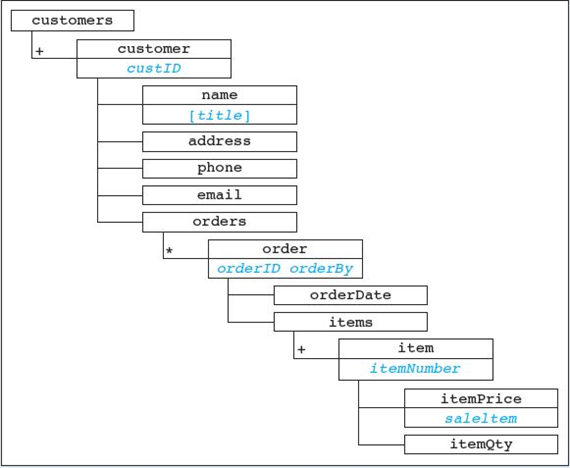
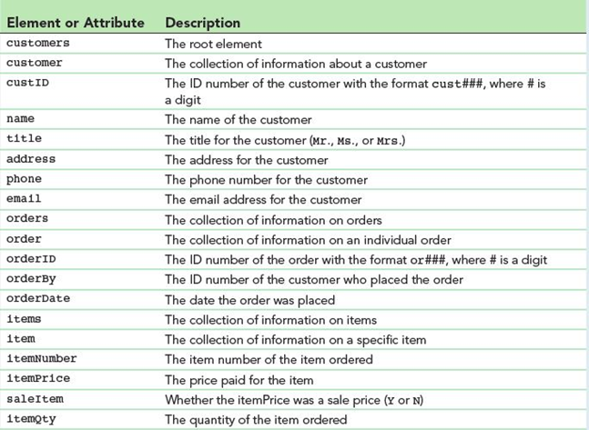

# XML Assignment 2
## COMP - 6000

- 1 XML Vocabulary, orders.xml and it's XML Schema document, orders.xsd

- The orders.xsd validates the orders.xml file in it's current untouched state, *which may be different than what was given in the figure

## Structure of the XML file

## Vocabulary definition and description
